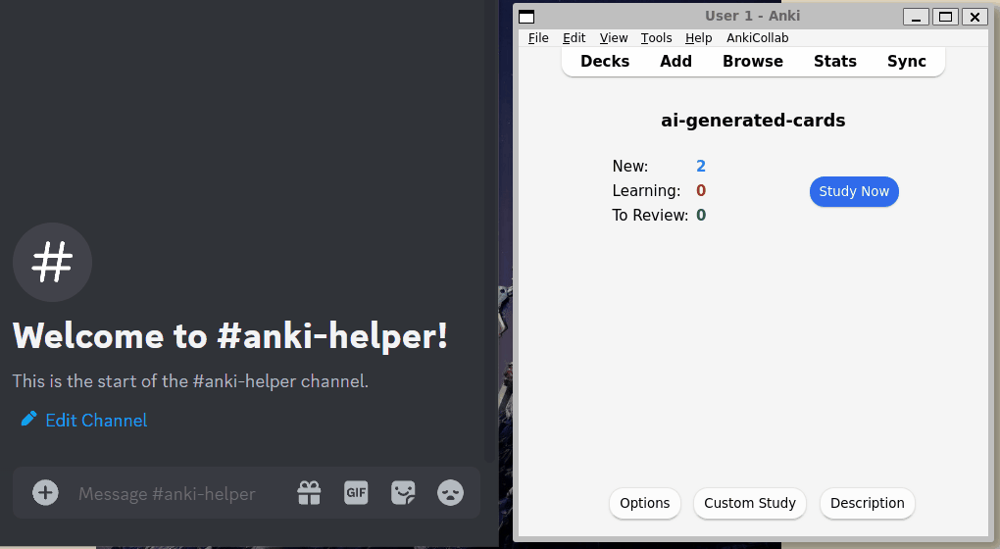

# AnkiHelper

AnkiHelper is a GPT-based AI assistant that creates entire Chinese flashcards in Anki from just 1 word. Save time while watching shows and instantly create cards with pinyin, translations, and example sentences.



Interfaceable through a Discord bot, the Anki Helper is currently available for self-hosting and development. WIP!

- [Usage](#usage)
- [Setup](#setup)
- [Development](#development)

## Usage

Once the assistant is [set up](#setup), the bot can be added to the Discord server and used by all members. 

Add cards with `!add` command followed by the deck/language (spanish, japanese, chinese supported). Deck names must be the same as the language name.
```
!add 苹果 chinese
```

## Setup

### API Registrations and Keys
1. Register [OpenAI API Account and Key](https://help.openai.com/en/articles/4936850-where-do-i-find-my-api-key)
2. Register [Discord App and Bot Token](https://discord.com/developers/applications)

### Create a Digital Ocean droplet

Create Digital Ocean Droplet with 1 gb memory, 25 gb disk, 1 cpu
Create SSH keys
Access via ssh

### Download and Configure Docker

Download docker via these instructions https://www.digitalocean.com/community/tutorials/how-to-install-and-use-docker-on-ubuntu-20-04
```
docker login
docker pull maizecyber/ankidesktop:new
docker pull maizecyber/ankibot:v1.1
```
```
docker run -d \
  --add-host=host.docker.internal:host-gateway \
  -p 3000:3000 \
  -p 8765:8765 \
  -v ~/.local/share/Anki2:/config/app/Anki2 \
  -v ~/backups:/config/app/backups \
  maizecyber/ankidesktop:new
```
```
docker run -d \
    --add-host=host.docker.internal:host-gateway \
    -e OPENAI_API_KEY=<key> \
    -e DISCORD_BOT_TOKEN=<key> \
    maizecyber/ankibot:v1.1
```
visit 
```
http://<ip of droplet>:3000/
```

install https://ankiweb.net/shared/info/2055492159
install https://ankiweb.net/shared/info/501542723

This is inherently super insecure. You should consider adding firewall rules to your server to whitelist your own IP address to access the droplet.
```
To                         Action      From
--                         ------      ----
22/tcp                     ALLOW IN    Anywhere                  
Anywhere                   ALLOW IN    <your ip>          
Anywhere on docker0        ALLOW IN    Anywhere                  
22/tcp (v6)                ALLOW IN    Anywhere (v6)             
Anywhere (v6) on docker0   ALLOW IN    Anywhere (v6)             

443                        ALLOW OUT   Anywhere                  
80/tcp                     ALLOW OUT   Anywhere                  
443 (v6)                   ALLOW OUT   Anywhere (v6)             
80/tcp (v6)                ALLOW OUT   Anywhere (v6) 
```
